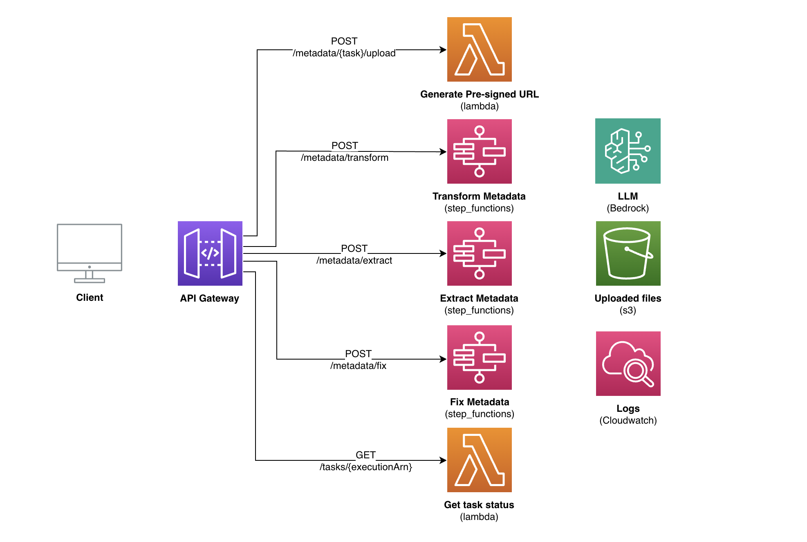
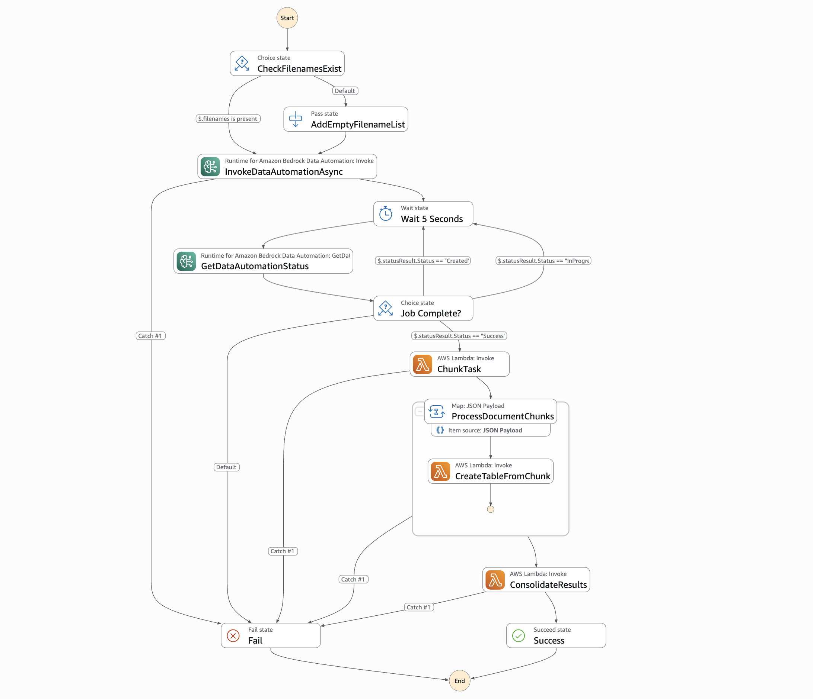
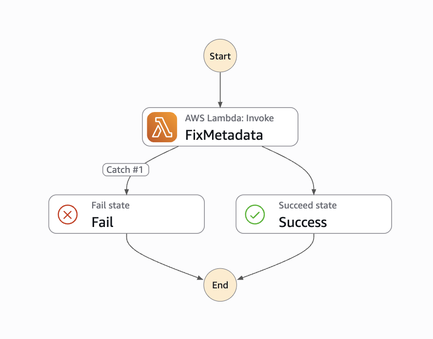
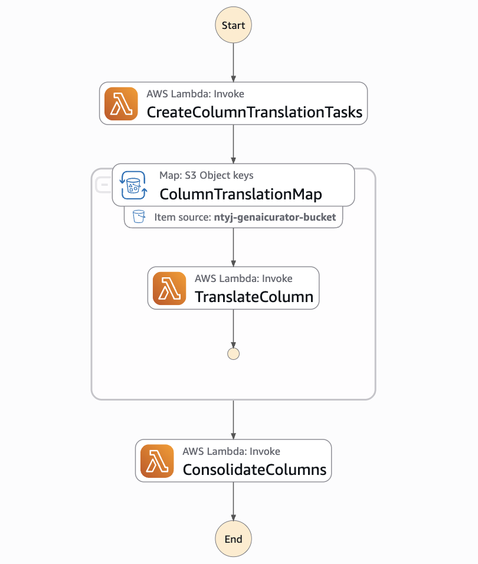

# Architecture

Curator workflows implement a serverless architecture pattern using AWS services to provide scalable, event-driven metadata processing capabilities.

## Core Components

### API Layer

- **API Gateway**: Provides RESTful API endpoints for client interaction
  - Secured with API Key authentication
  - Endpoints for metadata extraction, fixing, and transformation
  - Task status endpoint for polling job status

- **Lambda Functions**: Handle API requests and generate pre-signed URLs for file uploads
  - `generate_presigned_url`: Creates S3 pre-signed URLs for secure file uploads
  - `get_task_status`: Queries Step Functions execution status

### Processing Layer

- **Step Functions**: Orchestrate the metadata processing workflows
  - `extract_metadata`: Workflow for extracting metadata from documents
  - `fix_metadata`: Workflow for correcting invalid values in metadata tables
  - `transform_metadata`: Workflow for transforming metadata between schemas

- **Lambda Functions**: Perform the actual metadata processing tasks
  - Document processing functions (chunk_task, create_table, consolidate_results)
  - Value correction functions (create_col_chunks, create_correction_key, apply_corrections)
  - Table transformation functions (create_col_translation_tasks, translate_col, consolidate_cols)

### Storage Layer

- **S3 Bucket**: Stores input files, intermediate results, and output files
  - Organized by workflow type and job ID
  - Files are uploaded via pre-signed URLs generated by Lambda functions
  - Stores job status information in metadata

### AI/ML Layer

- **Amazon Bedrock**: Provides AI capabilities for metadata processing
  - Bedrock Data Automation for document text extraction
  - Foundation models for structured data extraction and transformation
  - Schema-aware value correction

## Data Flow

1. **Client Interaction**:
   - Client requests a pre-signed URL for file upload
   - Client uploads file to S3 using the pre-signed URL
   - Client calls the appropriate API endpoint to start the Step Function workflow

2. **Metadata Extraction Flow**:

- Document is processed by Bedrock Data Automation to extract text
- Text is chunked to stay within model context limits
- Each chunk is processed to extract structured metadata
- Results are consolidated into a single CSV file

3. **Value Correction Flow**:

- Input table is analyzed to identify invalid values
- Invalid values are processed in parallel to generate corrections
- AI-generated corrections are applied to create a cleaned table
- Correction statistics and details are provided in the output

4. **Table Transformation Flow**:

- Source table is analyzed to understand its structure
- Translation tasks are created for each target column
- AI generates SQL operations to transform source columns to target schema
- Operations are applied to create the final transformed table

## Security

- API Key authentication for all API endpoints
- IAM roles with least privilege permissions for Lambda functions
- S3 bucket policies to restrict access to authorized services
- Pre-signed URLs with short expiration times for secure file uploads

## Scalability

- Serverless architecture scales automatically with demand
- Step Functions distribute processing across multiple Lambda functions
- Parallel processing of document chunks and table columns
- Automatic scaling for all serverless components

## Monitoring and Logging

- CloudWatch Logs for Lambda function logs
- CloudWatch Metrics for API and function performance
- Step Functions execution history for workflow tracking
- S3 metadata for task status tracking and history
